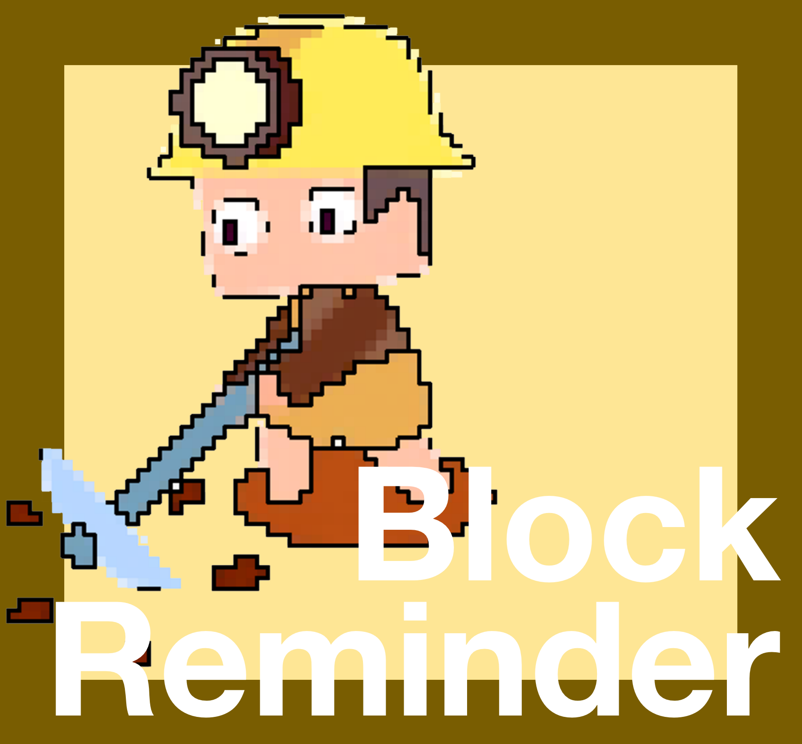

# BlockReminder



## Plugin Functions
When a player places or mines a block, a message will be sent to them.

## Plugin Information
**Tested Version**: 1.20.1
**Server Software**: Spigot, Paper

## Plugin Usage
Directly add configuration items in the configuration file. After restarting the server, the plugin configuration will take effect.

## Plugin Permissions

### Permission to Bypass Listening Events

Permission: `BlockReminder.bypass.<group name>`

Example: Players who have the permission `BlockReminder.bypass.test1` can bypass the behavior control of this group.

## Configuration File

config.yml

```yaml
test1:
  # The block placed
  material: ancient_debris
  # The message sent to the player
  message: '§eCongratulations on mining 1 ancient debris!'
  # After how many seconds, if the player continues to place this block, the message will be sent to the player again
  # (To prevent being reminded every time a block is placed)
  # (If set to 0, a reminder will be sent every time a block of this kind is placed)
  delay: 0
  # Whether to revoke this event (mining / placing)
  revoke: false
  # The worlds where this configuration is enabled
  worlds: world_nether
  # The event to listen to: placing / mining
  behavior: destroy
test2:
  material: soul_sand
  message: '§cPlease don't create wither in the overworld!'
  delay: 10
  revoke: true
  worlds: world
  behavior: place
test3:
  material: beacon
  message: '§eCongratulations on creating 1 beacon!'
  delay: 0
  revoke: false
  worlds: world, world_nether, world_end
  behavior: place
```

**material**: The block placed.

**message**: The message sent to the player.

**delay**: After how many seconds, if the player continues to place this block, the message will be sent to the player again. (If set to 0, a reminder will be sent every time a block of this kind is placed.)

**revoke**: Whether to revoke this event (mining / placing).

**worlds**: The worlds where this configuration is enabled.

**behavior**: Placing / mining. 
